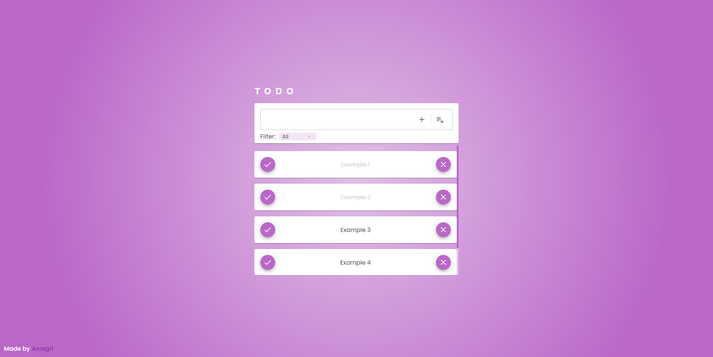
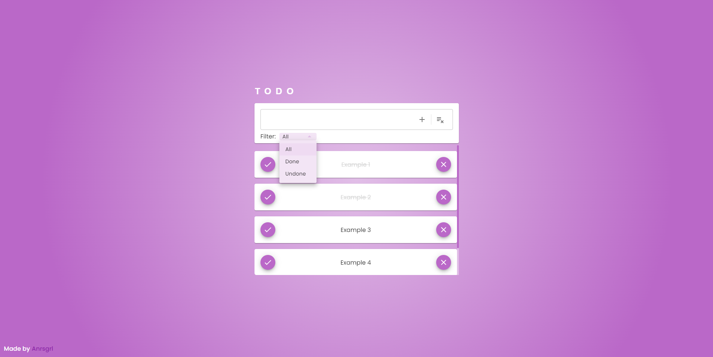

# To Do List📝

A dynamic and aesthetic To-Do List      
**(Save in localstorage)**


## Screenshots

[](https://todo-list-by-anrsgrl.netlify.app)
[](https://todo-list-by-anrsgrl.netlify.app)

## Tech Stack
- **JavaScript:** The primary programming language.
- **React:** Utilized for building the user interface.
- **Redux toolkit:** Employed for state management.
- **Material UI (MUI):** Styling and layout of components.
- **Framer Motion:** Integrated for animations.


## Run Locally

Clone the project

```bash
  git clone https://github.com/Anrsgrl/todo-list
```

Go to the project directory

```bash
  cd todo-list
```

Install dependencies

```bash
  npm install
```

Start the server

```bash
  npm start
```


## Authors

- [Anrsgrl](https://www.github.com/Anrsgrl)
